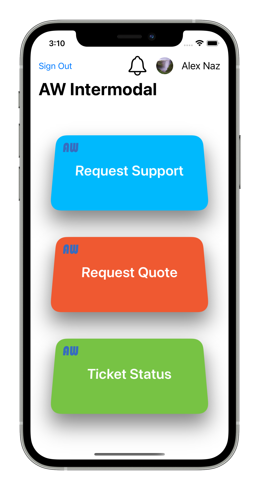
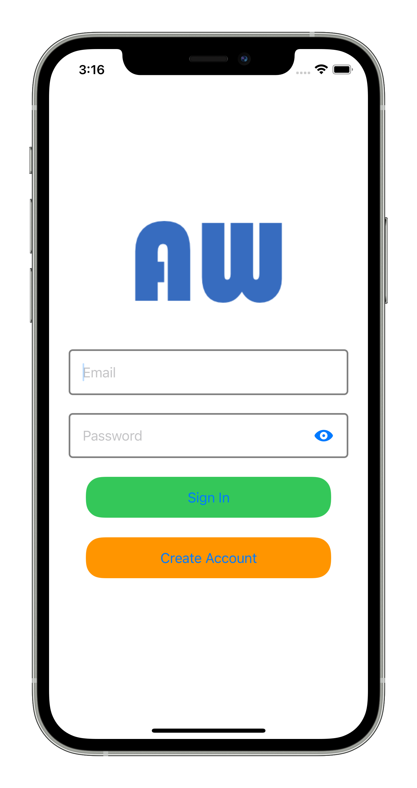
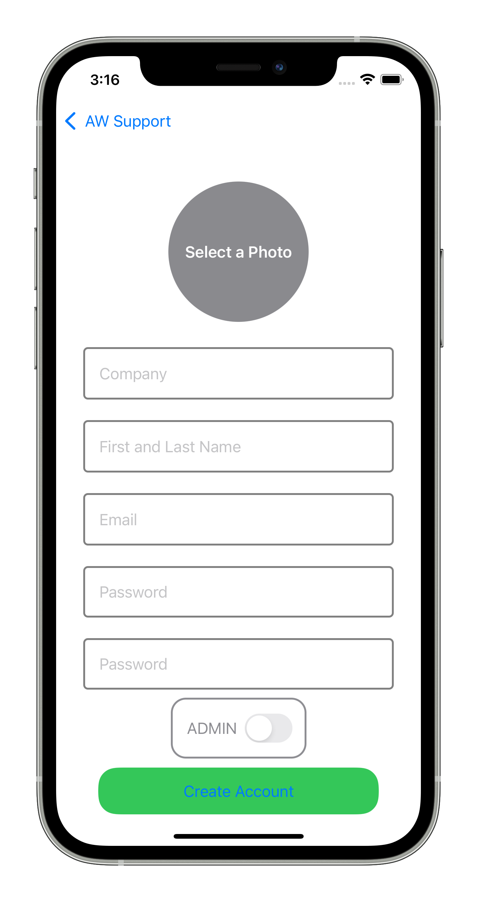
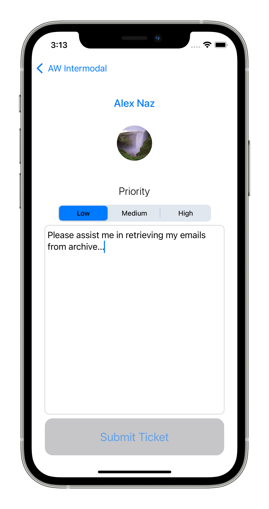
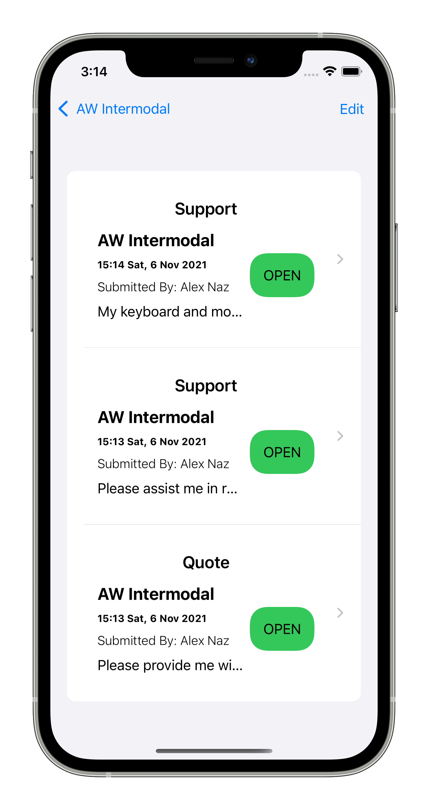
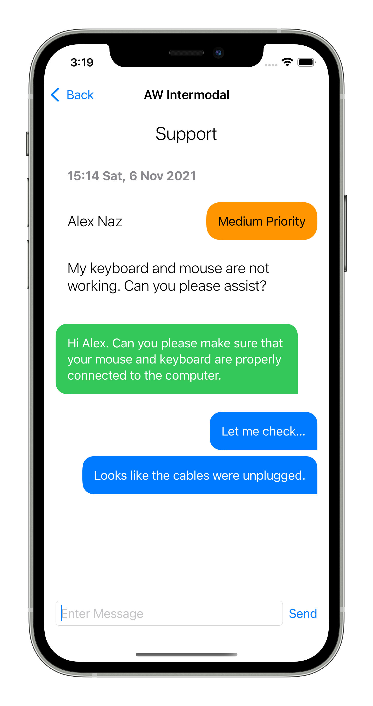
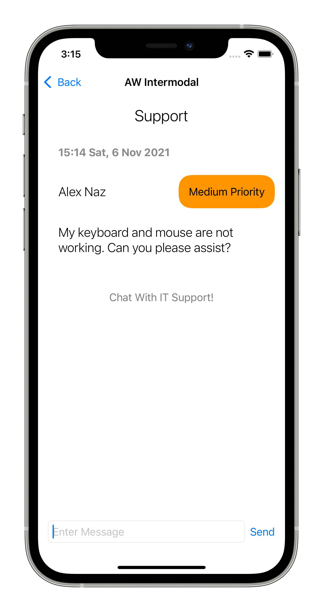

# AWSupportLogger
<a href="https://www.garynazdev.com/">

> A Utility Application for Submitting and Tracking IT Support Tickets.
## Table of contents
* [General info](#general-info)
* [Screenshots](#screenshots)
* [Technologies](#technologies)
* [Requirements](#requirements)
* [Setup](#setup)
* [Features](#features)
* [To Do](#To-do-list)
* [Inspiration](#inspiration)
* [Contact](#contact)

## General info
The purpose of this project is to build an application to provide a platform for business clients to submit their support tickets, where they can also monitor the status of their tickets without the need for phone or email contact with an IT Support Specialist.

## Screenshots
      

## Technologies
* SwiftUI
* Firebase Firestore
* Firebase Cloud Storage
  
## Requirements
* iOS 13+
* Xcode 12+

## Setup
* Clone and setup the project.
* Open in Xcode: open AWSupportLogger.xcworkspace

## Features
* Submit IT Support Technical Support Tickets.
* Request a Quote for hardware or support related inquiries.
* Chat directly with a Technical Support Specialist.

## To-do list
* Create Unit Tests.
* Allow clients to submit screenshots into chat.

## Inspiration
This app was designed to facilitate interaction interactions between clients and IT Support Specialists as an alterantive to using email.
The idea is to provide clients with a platform where they can immediately check on the status of their ticket submissions, while also 
having the option to chat directly with the IT Specialist who is working on fulfilling the client's request.

## Contact
Created by Gary Nazarian - feel free to contact me at garynaz@icloud.com
